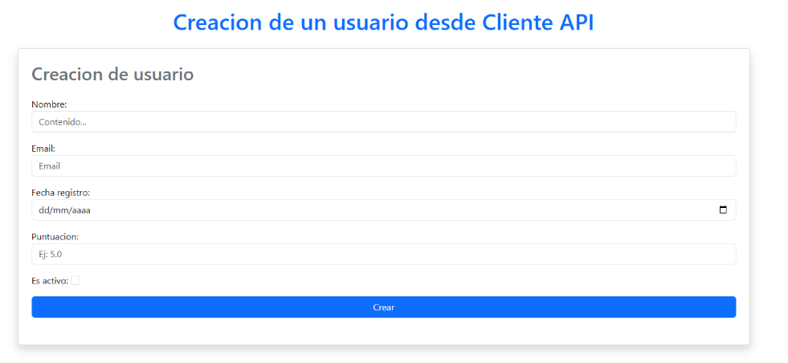

COMANDO DOKCER: 

docker run -d -p 8090:8090 --name mi_cliente_container mi_cliente_image

Este es un tutorial para poder acceder a la aplicación de Tutoriales:

En primer lugar deberemos de irnos a esta cuenta de github: 

https://github.com/kowbalsqui/Proyecto1Modelos.git

https://github.com/kowbalsqui/Proyecto1Modelos_API_Cliente.git

Estos dos enlaces son la aplicación de la api y la del cliente, vamos a realizar el proceso de instalación, dentro de estos enlaces nos mostrar una página como esta

Lo que tenemos que hacer dentro de ella es darle al botón de code y Descarga

Cuando lo hayamos descargado lo que vamos a hacer es descomprimir esa carpeta y abrimos nuestro visual studio code de nuestra carpetas.

(Recalco el mismo procedimiento de descarga que hemos hecho con una, es idéntico a la otra)

Una vez dentro de nuestra aplicación, nos situamos en la aplicación ProyectoModelos1 (es la api)

y deberemos de escribir lo siguiente en nuestra terminal:

cd proyectoModelos
pip install -r requeriments.txt

y en el proyecto de cliente haremos lo mismo

cd proyectoModeloClienteAPI
pip install -r requeriments.txt

una vez tenemos este paso lo que vamos a hacer es lo siguiente, dentro de nuestro servidor, lo arrancaremos con comando runserver:

y el cliente igual

 
vemos en el comando que tienen un número al final como 8092 o 8090, esos son los puertos con los que he estado trabajando y les recomiendo que los pongan igual por el tema de la compatibilidad, ya que están configurados para esos puertos. 

Ahora una vez le demos en la api a http://127.0.0.1:8090/

nos cargara la página de inicio de nuestra aplicación

ahora nos tendremos que loguear de alguna manera, seria registrándose, pero en mi caso voy a loguearme con un usuario que ya tengo.

una vez he iniciado sesion vemos lo siguiente

ya aparecemos ahí arriba, para irnos a la pagina principal le daremos donde dice Menú Principal en la barra de navegación: 

ahora vamos a ver como realizar las acciones GET, POST, PUT, PATCH, DELETE:

GET: 

clickeamos donde dice “lista” en listar cursos por ejemplo y ya nos hace el get

POST

para el post nos iremos a la parte de abajo

y le daremos donde dice crear Usuario desde la api

solo queda rellenar los campos con los datos de nuestro usuario que vayamos a crear

y cuando lo tengamos y le demos a crear

nos manda a la página de los usuarios y nos dice “se ha creado” y si bajamos abajo del todo 

vemos ahí a creacion1

PUT:

para el put vamos a seguir en la página de usuario y de los botones le daremos a editar

en mi caso voy a editar el la puntuación de creacion 1 porque le quiero poner un 3, entonces se la cambiamos: 

y cuando le demos a crear nos saldrá la siguiente pagina

es decir que hemos modificado al usuario y ahí tenemos sus datos actualizados los cuales si verificamos dentro de nuestra página de usuarios

vemos que tenemos correctamente la puntuación modificada

PATCH: 

para el patch lo que haremos será darle en vez de editar a editar Nombre, ya que solo edita un campo, entonces ahora quiero que creación 1 se llame gorgonzola, entonces le doy 

y lo cambio

y cuando le de a crear

me lleve a la página en la cual me dice que se han cambiado y si lo verificamos ahora en la página de usuario veremos los cambios:

DELETE:

y para borrar le damos al boton donde nos dice “Eliminar” 

nos saltara este mensaje por si le hemos dado inseguros o sin querer, si le damos que si

ya nos está gorgonzola, se habría eliminado.

